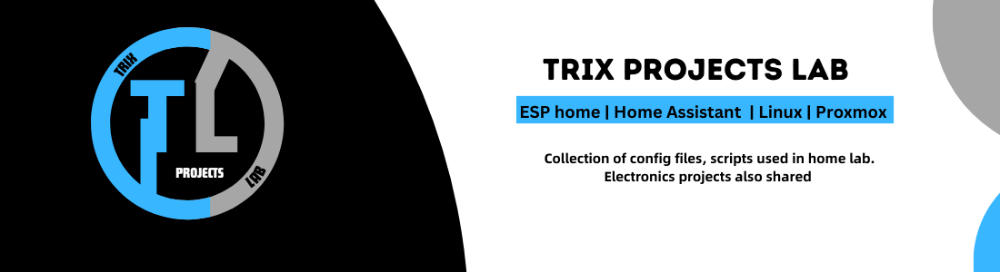
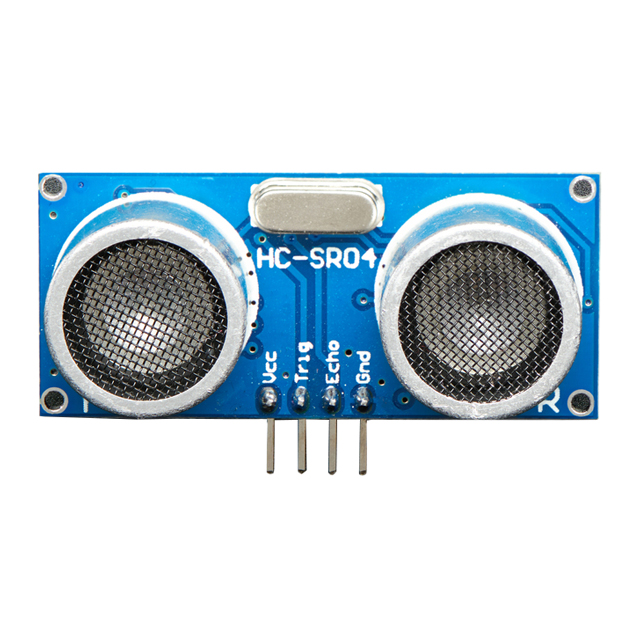
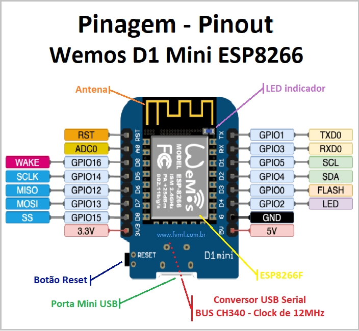

#  Esp Home Configs And Projects 


All yaml files and hardware details from projects with ESP home.
- ESPHome Ultrasonic Water Level Sensor
- ESPhome Light Sensor
- ESPhome Tag Reader

## ⬇️ ESPHome Ultrasonic Water Level Sensor

## Project Overview
This ESPHome configuration monitors water levels using an ultrasonic sensor connected to an ESP8266 microcontroller. 
It includes setting up Wi-Fi, configuring a static IP, and processing sensor data.

## Requirements
- ESP8266 microcontroller board (e.g., Wemos D1 Mini)
- Ultrasonic sensor compatible with ESPHome (HC-SR04 Ultrasonic Range Sensor Used For This project see below)
- Access to Home Assistant (optional)

  
## Hardware Connections
- Trigger Pin to Pin 0 (D3)     (May differ if another board is used)
- Echo Pin to Pin 2 (D4)        (May differ if another board is used)
- 5V + Gnd Connections

  

## Setup Instructions

### 1. Install ESPHome
If not installed, follow the [ESPHome installation guide](https://esphome.io/guides/getting_started_command_line.html).

### 2. Create Configuration File
Create a new YAML file (e.g., `ro_tank.yaml`) and paste the following configuration:

```yaml
esphome:
  name: #Any name here 
  friendly_name: #Any name here

esp8266:
  board: esp01_1m #check your board change as needed.

logger:

# Home Assistant API (optional but recommended).
api:
  # Encryption key for secure communication with Home Assistant.
  encryption:
    key: "your_encryption_key_here"

ota:
  # OTA password for over-the-air updates.
  password: "your_ota_password_here"

wifi:
  # Replace with your Wi-Fi credentials.
  ssid: "your_wifi_ssid"
  password: "your_wifi_password"

  manual_ip:
    # Replace with your static IP configuration.
    static_ip: 192.168.x.x
    gateway: 192.168.x.x
    subnet: 255.255.255.0
    dns1: 8.8.8.8

  ap:
    # Fallback hotspot settings in case Wi-Fi connection fails. Can be removed if needed !
    ssid: "Ro-Tank Fallback Hotspot"
    password: "fallback_hotspot_password"

sensor:
  - platform: ultrasonic
    name: Water Level Sensor
    id: water_level_sensor
    unit_of_measurement: '%' # Will show water level as a percentage. 
    icon: mdi:water
    trigger_pin: 0  #Check your board  
    echo_pin: 2
    update_interval: 10s  
    filters:
      # Lambda filter to adjust sensor output
      # Replace values 65 with the actual height of your tank or max water level in centimeters.
      # Do not change anything else if you dont have to.
      - lambda: return ((((x*100)-10)-(65-10))/(65-10))*-100; 
      # Filter out NaN (not-a-number) values
      - filter_out: nan
   ```
## Adapting for Tank Height:

To adjust the configuration for your specific tank height:

 **Replace `65` with the actual height of your tank in centimeters**:
   Update `(65 - 10)` with `(actual_height_cm - base_measurement_cm)`.

   For example, if your tank's height is 100 cm and the base measurement (lowest point where the sensor starts to detect) is 10 cm:
   ```yaml
   lambda: return ((((x * 100) - 10) - (100 - 10)) / (100 - 10)) * -100;
   ```
The `lambda` has been set with this sensor and tested for accuracy so only chnage the height values in order for it to work correctly.
## Notes
- Header pins on the board may need to be soldered if sensor is not found and error messages are found in the log.
- Customize yaml as per your specific requirements and environment.
- Contributions and improvements are welcome.

## ⬇️ ESPhome Light Sensor

